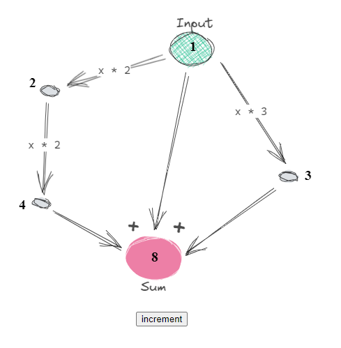

# Getting started

> npm install @xania/state

To get you started you only need to install the _@xania/state_ package

# Introduction

```typescript
import { State } from "@xania/state";

const count = new State(1);
const subscription = count.subcribe({
  next(value: number) {
    console.log(value);
  },
});

subscription.unsubscribe();
```

@xania/state is intended to be complementary to RxJS and is especially an alternative to BehaviorSubject and it's main goal to provide reactivity for the View library. RxJS is on the other hand better suited for handling events coming from view, e.g. for debounce, async, etc...

Reactivity in _@xania/state_ is in first place about setting up the logic of how the data flows, independent from whether or not the actual data is available. Secondly, when data is available or is changed then the states should be synchronised according to this logic.

We also allow observers to subscribe to the individual state values. These observer are immediately notified on subscription (when state current value is not `undefined`) and on changes of the state values. So when observers are being called we can be sure the state is changed.

## Core features

- monadic state (map, bind)
- topological sorting
- asynchronuous data (in progress)
- scheduling (in progress)
- batching (in progress)

## fine-grained state

### benchmark result:


# State

## Create new state object

```typescript
import { State } from "@xania/state";

function App() {
  const count = new State<number>();
}
```

## Combine latest

```typescript
import { State, combineLatest } from "@xania/state";

function App() {
  const x = new State<number>(1);
  const y = new State<number>(2);
  const sum = combineLatest([x, y]).map([x, y] => x + y)
}
```

# State operators

prop, map, bind

## Property operator

```typescript
import { State } from "@xania/state";

const person = new State({ firstName: "ibrahim" });
const firstName = person.prop("firstName");
```

## Map operator

```typescript
import { State } from "@xania/state";

const count = new State(1);
const isEvent = count.map((x) => x % 2 === 0);
```

## Bind operator

```typescript
import { State } from "@xania/state";

const count = new State(1);
const even = new State("even");
const odd = new State("odd");

const choice = count.bind((x) => (x % 2 === 0 ? even : odd));
```

<!-- <aside class="notice">
</aside> -->

<!-- <aside class="success">
Remember — a happy kitten is an authenticated kitten!
</aside> -->

# State mutations

```typescript
function App() {
  const selection = new State(1);

  const employee = await selection.map(fetchEmployee);
  // derived state allowes for mutations
  employee.prop("firstName").set("Ibrahim");
}
```

All types of state values allow for update. _@xania/state_ guarantees that when a state value is updated then the dependents are synchronised in most efficient and performant manner.
But it does not guarantee that all these mutation on state `s` will be synchronised with dependencies of `s`. In case `s` is derived from a property of a parent state then synchronisation is obvious, but when mapped by a `function` then after update of `s` we rely on events handling by user to propagate the value back to it's parent/dependencies. There are cases where this behavior is desirable for example when data in `s` first need to be verified manually send to backend and only after succesful save we propagate the values to the dependencies.

# Special case of undefined

```typescript
import { State } from "@xania/state";

const count = new State(1);
count.subcribe({
  next(value: number) {
    console.log(value);
  },
});
// prints: 1

count.set(undefined);
// count value is still 1
```

A new `State` object when no value is provided then `State` as not initialized in which case the observers will not be notified untill non `undefined` value is provided. Also updates with `undefined` value are not processed and the previous value is untouched.
This also applies for derived state, e.g. when a state value is mapped to undefined.

# Promises

```typescript
import { State } from "@xania/state";

async function App() {
  const id = fromnew State(1);
  const pokemon = count.bind(fetchPokemon);
}
```

# Interop

## from Observable

```typescript
import { from } from "@xania/state";
import { timer } from "rxjs";

const state = from(timer(0, 1000));
```

## from Promise

```typescript
import { from } from "@xania/state";

const state = from(Promise.resolve(1));
```

## from AsyncTterator

```typescript
import { from } from "@xania/state";

const state = from([1, 2, 3].values());
```

## from Event

```typescript
import { from } from "@xania/state";

const state = from([1, 2, 3].values());
```

# Diamond problem

[live demo](https://stackblitz.com/edit/vitejs-vite-cxno2b)


